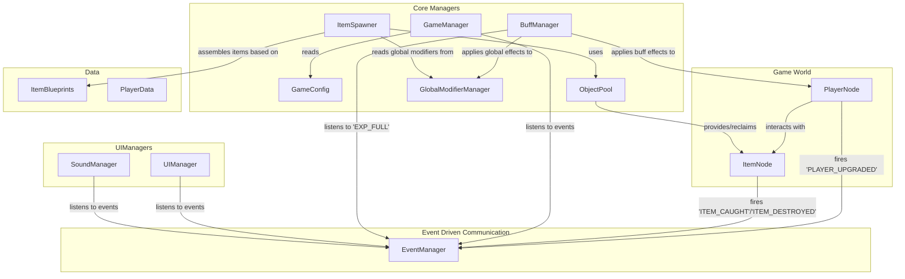

# Cat Puzzle - Game Architecture Document

This document outlines the software architecture for the Cat Puzzle game, a Roguelite item-catching game developed in Cocos Creator.

## 1. Core Philosophy & Principles

The architecture is built upon three core principles to ensure flexibility, scalability, and maintainability.

-   **Data-Driven Design**: Game content and behavior (e.g., item properties, movement patterns, interaction rules) are defined in external configuration files (data blueprints) rather than being hardcoded. This allows for rapid iteration, content creation, and balance adjustments without touching the core logic.

-   **Component-Based Assembly**: Game entities, especially falling items, are treated as containers. Their behavior is not monolithic but is composed by dynamically assembling small, single-purpose, reusable components (e.g., a trajectory component, a self-motion component). This enables creating a vast variety of entities through composition.

-   **Event-Driven Communication**: Modules are decoupled from each other via a central `EventManager`. Instead of direct calls, modules communicate by broadcasting and listening to events (e.g., `ITEM_CAUGHT`, `PLAYER_UPGRADED`). This reduces dependencies, simplifies logic, and makes the codebase easier to extend.

## 2. Project Structure

A clean and logical directory structure is crucial for project organization.

```
assets
|-- docs/
|   `-- architecture.md      # This document
|
|-- scenes/                  # Game Scenes
|   |-- main-menu.scene
|   |-- game.scene
|   `-- game-over.scene
|
|-- scripts/                 # TypeScript Scripts
|   |-- core/                # Core frameworks and managers
|   |   |-- GameManager.ts   # Main game loop and state machine
|   |   |-- EventManager.ts  # Global event bus for decoupled communication
|   |   |-- DataManager.ts   # Handles loading/saving player data
|   |   |-- UIManager.ts     # Manages UI screens and elements
|   |   `-- ObjectPool.ts    # Manages recycling of nodes (items, bullets)
|   |
|   |-- game/                # Gameplay logic controllers
|   |   |-- ItemSpawner.ts   # Assembles and spawns items based on blueprints
|   |   |-- PlayerCtrl.ts    # Manages player actions (movement, shooting)
|   |   `-- Floor.ts         # Handles logic for missed items
|   |
|   |-- entities/            # Entity-specific logic components
|   |   |-- Board.ts         # Player board state and stats
|   |   |-- Item.ts          # Core script for falling items, hosts behaviors
|   |   `-- StatSheet.ts     # Component for managing stats and modifiers
|   |
|   |-- behaviors/           # Reusable behavior components for items
|   |   |-- trajectories/    # "Orbit" motion (e.g., Vertical, Feather)
|   |   `-- self_motions/    # "Self-rotation" motion (e.g., Spin, Pulse)
|   |
|   |-- buffs/               # Roguelite upgrade system
|   |   |-- BuffManager.ts   # Manages buff selection logic
|   |   `-- BuffLibrary.ts   # Data definitions for all buffs/upgrades
|   |
|   |-- interaction/         # System for handling collisions and interactions
|   |   |-- IInteractable.ts # Interface for things that can be interacted with
|   |   `-- Interactor.ts    # A tag component for things that initiate interaction
|   |
|   `-- data/                # Data-only definitions
|       |-- GameConfig.ts    # Global game balance constants
|       |-- PlayerData.ts    # Player save data structure
|       `-- ItemBlueprints.ts# The heart of the data-driven design
|
|-- prefabs/                 # Reusable node hierarchies
|   |-- items/
|   |-- boards/
|   `-- ui/
|
|-- textures/
`-- sounds/
```

## 3. Core System Designs

### 3.1. Item Creation: The Assembler

Items are created dynamically by an `ItemSpawner` following a blueprint. This process separates the "what" from the "how".

```mermaid
graph TD
    subgraph Configuration
        A[ItemBlueprints.ts] -- "Defines 'Spinning Feather'<br/>- FeatherTrajectory<br/>- SpinMotion<br/>- Base Stats" --> B(ItemSpawner);
    end

    subgraph PlayerBuffs
        C[GlobalModifierManager] -- "Provides global modifiers<br/>(e.g., -20% speed)" --> B;
    end

    subgraph AssemblyProcess in ItemSpawner
        B -- "1. Reads Blueprint & Global Modifiers" --> B;
        B -- "2. Gets a recycled node from ObjectPool" --> D[Item Node];
        D -- "3. Calculates Final StatSheet" --> E[Final Stats (speed, rotation, etc.)];
        
        subgraph "4. Dynamically adds behavior components"
            B -- "add FeatherTrajectory" --> D;
            B -- "add SpinMotion" --> D;
        end
        
        E -- "5. Injects stats into components" --> F[FeatherTrajectory];
        E -- "5. Injects stats into components" --> G[SpinMotion];
    end
```

### 3.2. Stat & Modifier System

This system provides maximum flexibility for upgrades. Instead of rigid levels, entities have a `StatSheet` where a final value is calculated from a base value plus a list of additive and multiplicative modifiers.

-   **Applies to**: Player `Board` (speed, length), Player `ShootAction` (bullet speed, damage), and global item properties (fall speed, amplitude).
-   **Process**: `Final Value = (Base Value + Sum of Flat Modifiers) * Product of Multiplicative Modifiers`
-   **Source**: Modifiers are added/removed by the `BuffManager` when the player selects an upgrade.

### 3.3. Abstract Interaction System

To accommodate both "catching" and "shooting" modes, the interaction logic is abstracted.

```mermaid
graph TD
    subgraph PlayerNode
        A[PlayerCtrl] -- Manages --> A2[ShootAction];
        A2 -- "Generates" --> B[Bullet Prefab];
        C[BoardNode] -- "Has" --> C1[Interactor (type: BOARD)];
    end
    
    B -- "Has" --> B1[Interactor (type: BULLET)];

    subgraph ItemNode
        D[Item.ts] -- "Implements" --> E[IInteractable];
        D -- "Reads its interaction rules from" --> F[ItemBlueprint];
    end

    subgraph CollisionEvent
        C1 -- "Collides with" --> D;
        B1 -- "Collides with" --> D;
        D -- "Triggers its onInteract() method" --> D;
    end
    
    subgraph GameLogic
      D -- "Fires event based on rules (e.g., 'ITEM_CAUGHT')" --> G[EventManager];
      H[GameManager] -- "Listens to event and updates score/chaos" --> G;
    end
```

-   **Interactor**: A tag component on the `Board` or `Bullet` that says "who" is initiating the interaction.
-   **Interactable**: An interface on the `Item` that contains the `onInteract()` logic. The item itself decides if the interaction is valid (e.g., an "Apple" can be caught by a "BOARD" but not a "BULLET") and what the outcome is.

## 4. Overall Architecture & Data Flow

This diagram shows how the major systems communicate, primarily through the central `EventManager`.



This architecture provides a solid and scalable foundation for the game, allowing for easy addition of new content, features, and even gameplay modes in the future.
